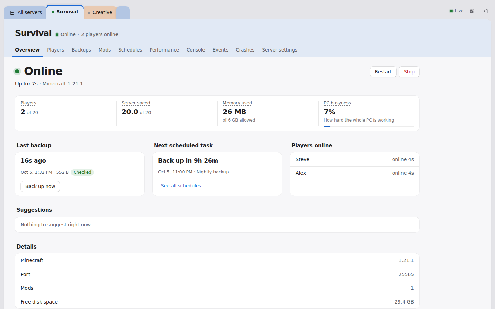
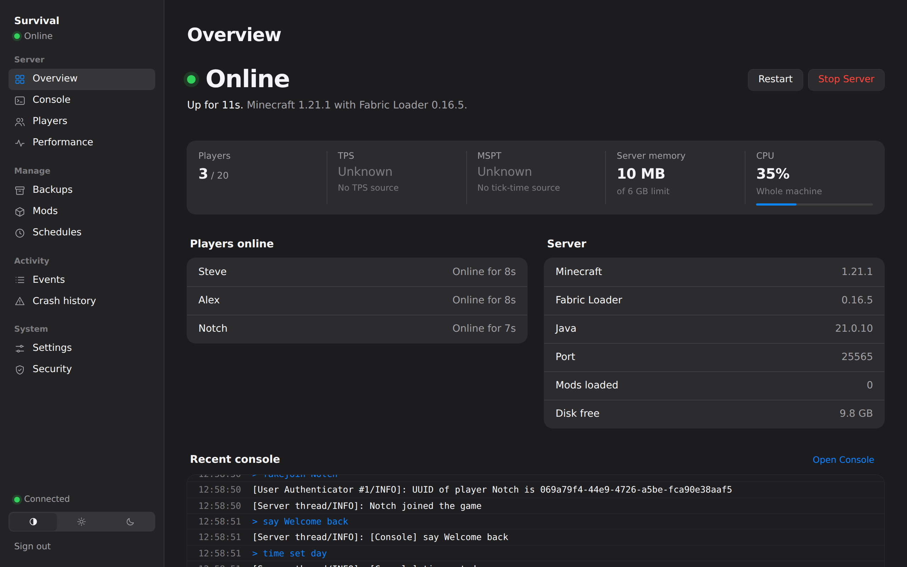
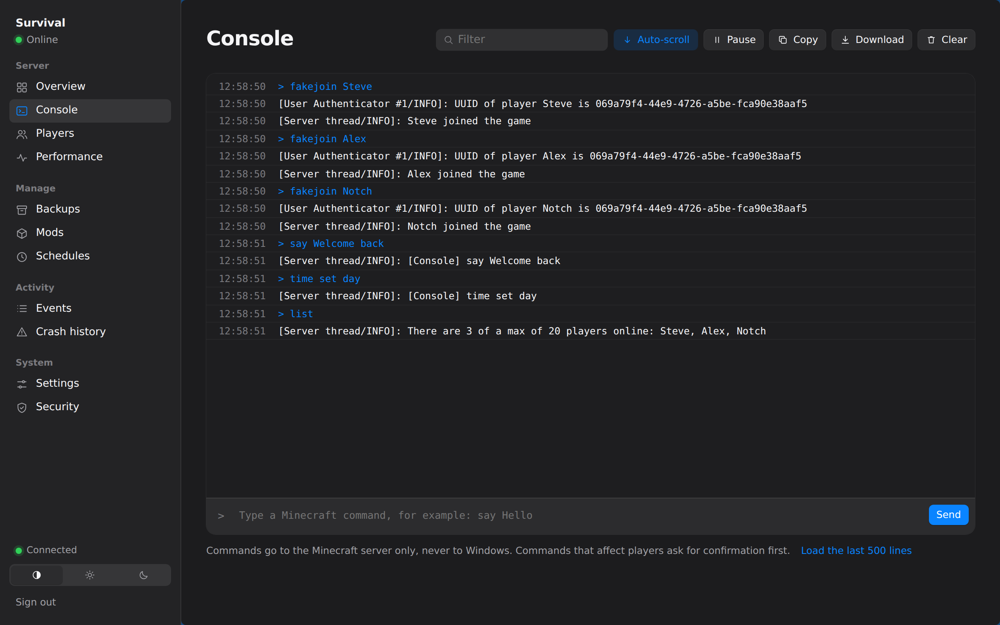
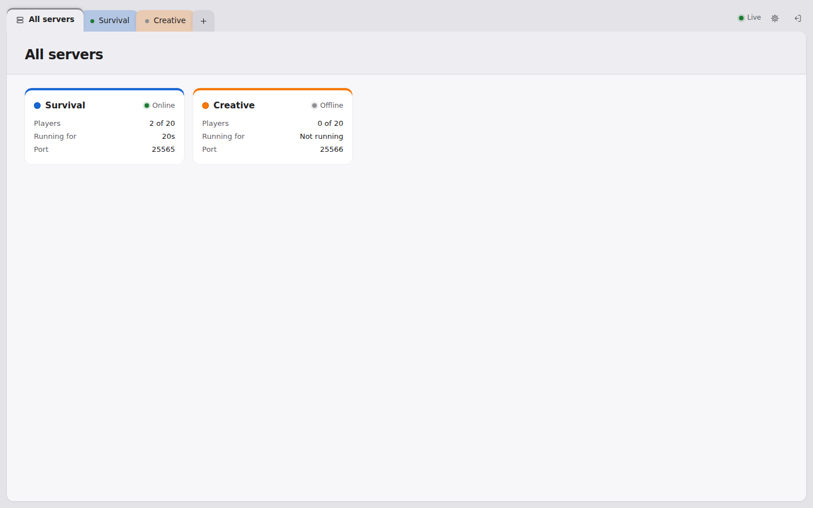
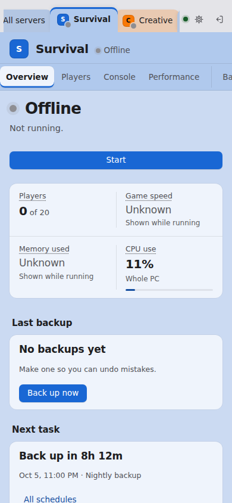

# Minecraft Server Controller

A self-hosted control panel for Minecraft servers on Windows — Vanilla,
Fabric, Quilt, Forge, NeoForge, Paper and Purpur. A small
agent runs on the server PC, supervises the Minecraft process, and serves a
dashboard you can open from your computer or phone over a private
[Tailscale](https://tailscale.com) network, using HTTPS.

## Features

- Start, stop and restart the server, with a graceful stop and a forced stop
  only after a timeout
- Live status: running, starting, stopping, crashed, uptime, players, memory
  and CPU
- TPS and MSPT when a tick-rate source is available (Carpet, spark, or
  `tick query` on 1.20.3+); shown as *Unknown* otherwise, never guessed
- Live server console with filter, copy, download and command input.
  Commands go to Minecraft only, and risky ones ask first
- Crash detection that tells a crash from a normal stop, saves the evidence,
  and names a likely cause with its confidence
- Automatic restart after a crash, with crash-loop protection
- Player tracking: who's online, sessions and total playtime
- Backups of worlds, config and mods, verified before they're trusted, with
  safe restore, one-click undo and retention
- Limit each server to some of the PC's CPU cores, applied to the running
  server at once and read back from its process
- Mod manager: install from Modrinth with checksum verification, enable,
  disable, update, roll back, and dependency checks. On Paper and Purpur it
  is the plugins folder instead, and it says so
- Make a new server from scratch: pick the kind from a comparison table and
  a Minecraft version, and it is downloaded, checked against the checksum
  its own project published, and set up
- Change a server's version, up or down, or change the kind of server it is.
  It stops, takes a verified backup, tells you first what will happen, and
  one button puts the old version back
- Let Bedrock players join a Java server (Geyser and Floodgate), with the
  differences they will notice written out in plain words
- Scheduled tasks: backups, restarts, log cleanup, maintenance windows
- Discord and email alerts
- Starts with Windows through a scheduled task, without anyone logging in
- HTTPS, hashed passwords, session tokens, rate limiting, audit log,
  Tailscale-only access
- One tab per server, each in its own color (twelve to pick from, or any
  color), with text kept readable on every color
- Five themes (match your device, light, dark, graphite, high contrast) that
  follow your account to every device
- Simple mode in everyday words, or Technical mode with the exact terms (TPS,
  MSPT, RSS, `-Xmx`) and extra detail; every label has both

## Screenshots



| Overview, dark theme | Console, dark theme, Technical mode |
| --- | --- |
|  |  |

| All servers | Overview on a phone |
| --- | --- |
|  |  |

## Requirements

- Windows 10 or 11 on the server PC
- Python 3.11 or newer, from [python.org](https://www.python.org)
- Java, the version your Minecraft needs. A server you already have works as
  it is; a new one can be made from the dashboard
- [Tailscale](https://tailscale.com) on the server PC and on every device you
  want to connect from

## Installation

On the server PC, from the project folder:

```powershell
.\setup.ps1
```

This finds Python (3.11+), creates a virtual environment in `.venv`,
installs dependencies, then sets up whatever's missing: server folder,
dashboard password, HTTPS certificate, firewall rule, Windows startup task.
Works from any folder. Safe to re-run — existing settings are left alone.

Your password is stored only as a hash in `.env`, never shown, logged or
saved in plain text. Firewall and startup steps need Administrator rights;
setup offers to open an elevated window for them.

If Windows says the script "is not digitally signed," use `setup.cmd`
instead, or run `powershell -ExecutionPolicy Bypass -File .\setup.ps1`.
Either bypasses the policy for that one run only.

### Health check

```powershell
.\setup.ps1 --check
```

Read-only: verifies every component, changes nothing, and says what to do
about anything that fails. Options: `--logon` (start at login instead of at
boot), `--skip-firewall`, `--skip-startup`, `--non-interactive`.

Step-by-step detail: [docs/installation.md](docs/installation.md).

## Configuration

Settings live in `config/config.yaml`. Secrets live only in `.env`, created
by `make_secrets` and never committed.

| Setting | What to set |
| --- | --- |
| `server.directory` | **Required.** The folder that contains your server jar. There is no default. Several servers go in a `servers:` list instead ([how](docs/configuration.md#server-or-servers)). |
| `server.type` | `vanilla`, `fabric`, `quilt`, `forge`, `neoforge`, `paper` or `purpur`. Left out, it is read as `fabric`, as before |
| `server.jar` | Your server jar, e.g. `fabric-server-launch.jar`. Forge and NeoForge use `server.args_file` instead, written by their installer |
| `server.java` | `java`, or the full path to `java.exe` |
| `server.jvm_args` | Memory and JVM options, e.g. `["-Xmx6G"]` |
| `network.host` | This PC's Tailscale address, from `tailscale ip -4` |
| `tls.hostname` | The name you type in the browser, e.g. `server-pc.your-tailnet.ts.net` |
| `monitor.tps_command` | `auto` (default) detects it; or force `tick query`, `tps`, `spark tps`; `off` disables |

The agent keeps its database, backups and certificates in
`C:\ProgramData\Minecraft Server Controller` (an older install's
`<server>\mcsc-data` is copied there once, and the original left in place:
[details](docs/configuration.md#the-data-folder-pathsdata_dir)).

Every option is described in [docs/configuration.md](docs/configuration.md).
Discord and email alerts: [docs/notifications.md](docs/notifications.md).

## How it handles…

### Crashes and automatic restart

When Minecraft exits without being asked to, the agent records the crash,
names a likely cause from the log, and starts a countdown if automatic
restart is on (`monitor.restart_delay`, 10 seconds by default). The
dashboard shows **Restarting in 7s** with two choices: **Restart Now**
skips the countdown, **Cancel** stops it and the server stays down.

During the countdown the Start button is hidden, and the agent refuses a
second start, so two server processes can't run at once. After repeated
crashes (`monitor.max_crashes` within `monitor.crash_window_minutes`)
automatic restart pauses until you allow it again.

### TPS

With `monitor.tps_command: auto`, the agent tries `tick query` (vanilla
1.20.3+), `tps` (Carpet) and `spark tps` once when the server finishes
starting, uses the first that answers with real figures, and remembers it
for next time. It never polls on a timer. If none answers, TPS shows as
unavailable with the reason — never estimated. On vanilla, TPS is
calculated from the measured tick time, not the configured target rate. To
force a command, use **Performance → TPS monitoring → Change Command**, or
set `monitor.tps_command` in `config.yaml`.

### Mod dependencies

The Mods page lists every missing, disabled, or wrong-version dependency by
name, with the version required ("Any version," "1.2 or newer") and which
mod needs it. **Install Missing Dependencies** looks them up on Modrinth,
picks a version that satisfies the range, follows their own dependencies (A
needs B needs C), and shows the full list before downloading anything. Each
download is checksum-verified, nothing already installed is replaced, and a
mod the server is running with isn't touched — stop the server first.

## Running

```powershell
python -m agent.main
```

Open `https://<tls.hostname>:8765` and sign in. Once `autostart enable` has
run, the agent starts by itself whenever Windows starts; check it with
`python -m installer.autostart test`.

## Project structure

```
agent/              the server agent
  api/              REST API and live WebSocket
  minecraft/        process control, console parsing, crash analysis
  servertypes/      what each kind of server is, its versions and installs
  mods/  backups/  monitoring/  notifications/  scheduler/  security/
  downloads.py      the one safe downloader
  crossplay.py      Geyser and Floodgate for Bedrock players
  web/              the dashboard (plain HTML, CSS and JavaScript)
  main.py           entry point
installer/          secrets, certificates, firewall, Windows startup
config/             config.example.yaml
docs/               installation, HTTPS, Tailscale, mods, backups, API and more
scripts/            end-to-end and browser checks
tests/              automated tests, with a fake Minecraft server
```

## Tests

```powershell
pip install -r requirements-dev.lock
python -m pytest -q
python -m ruff check . ; python -m ruff format --check . ; python -m mypy
```

See [docs/testing.md](docs/testing.md) for the browser and end-to-end checks,
the lock files and pre-commit.

### CI

`.github/workflows/ci.yml` runs on every push and pull request:

- **Lint and type check**: `ruff check`, `ruff format --check` and `mypy`,
  with the settings in `pyproject.toml`.
- **Unit tests** on both Linux and Windows.
- **Dashboard in a real browser**: `scripts/ui_check.py --quick` signs in and
  visits every page in headless Chromium in both Simple and Technical mode,
  and fails on any JavaScript or console error, failed request, sideways
  scrolling, code text such as `undefined` on the page, or text without
  enough contrast. The screenshots are kept as a build artifact.

### Windows CI

`.github/workflows/windows-startup-test.yml` runs on every push, on
GitHub's `windows-latest` runners:

- **Startup task**: registers a real scheduled task under a unique name,
  reads it back from Windows and checks its settings, launches it and
  confirms the agent started from the right folder, then removes it and
  confirms it's gone. The task is always deleted, even if a step fails.
- **Setup script**: runs `setup.ps1` on Windows PowerShell 5.1 — from
  another folder, twice (to prove repeat runs keep existing settings), with
  Python missing, with a dependency removed, through `setup.cmd`, and
  `--check` — and checks the password never appears in output or files.

## License

Released under the [MIT License](LICENSE). Copyright (c) 2026 Mark Ramy.
